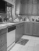
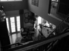
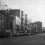
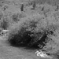

<h1> Jie-Kai Yang </h1>
<h1>Scene recognition with bag of words 

<h2>Brief</h2> 

 

<ul> 

  <li>  download <a href="http://www.vlfeat.org/download.html">VLFeat 0.9.17 binary package</a></li> 
  <li>VL Feat Matlab reference: <a href="http://www.vlfeat.org/matlab/matlab.html">http://www.vlfeat.org/matlab/matlab.html</a> 
  <li>Required files: </li>
  <li> README </li>
  <li>code/ - directory containing all your code for this assignment</li>	
  <li>html/ - directory containing all your html report for this assignment, including images</li>
  <li>html/index.html - home page for your results</li>	
</ul>

 
 
<h2>Overview</h2> 

 
The goal of this project is to introduce you to image recognition. Specifically, we will examine the task of scene recognition starting with very simple methods -- tiny images and nearest neighbor classification -- and then move on to techniques that resemble the state-of-the-art -- bags of quantized local features and linear classifiers learned by support vector machines.

Example scenes from of each category in the 15 scene dataset. Figure from <a href="http://www.di.ens.fr/willow/pdfs/cvpr06b.pdf">Lazebnik et al. 2006</a>.

<h2>Results</h2>

<ul>
 <li>Tiny images representation and nearest neighbor classifier (Accuracy (mean of diagonal of confusion matrix) is 0.199).</li>
 <li>Bag of SIFT representation and nearest neighbor classifier (when K=1, Accuracy is 41.5%).</li>
 <li>Bag of SIFT representation and linear SVM classifier (accuracy of 58.7%).</li>
</ul>

Bag of SIFT representation with Machine learning algorithm (last one is 1 vs all SVM) 

 5 fold cross-validation result 

<table border=0 cellpadding=4 cellspacing=1>
<tr>
<th>Category name</th>
<th>Accuracy</th>
<th colspan=2>Sample training images</th>
<th colspan=2>Sample true positives</th>
<th colspan=2>False positives with true label</th>
<th colspan=2>False negatives with wrong predicted label</th>
</tr>
<tr>
<td>Kitchen</td>
<td>0.450</td>
<td bgcolor=LightBlue></td>
<td bgcolor=LightBlue></td>
<td bgcolor=LightGreen></td>
<td bgcolor=LightGreen></td>
<td bgcolor=LightCoral> <small>Street</small></td>
<td bgcolor=LightCoral> <small>Office</small></td>
<td bgcolor=#FFBB55> <small>LivingRoom</small></td>
<td bgcolor=#FFBB55> <small>InsideCity</small></td>
</tr>
<tr>
<td>Store</td>
<td>0.510</td>
<td bgcolor=LightBlue></td>
<td bgcolor=LightBlue></td>
<td bgcolor=LightGreen></td>
<td bgcolor=LightGreen></td>
<td bgcolor=LightCoral> <small>TallBuilding</small></td>
<td bgcolor=LightCoral> <small>InsideCity</small></td>
<td bgcolor=#FFBB55> <small>Forest</small></td>
<td bgcolor=#FFBB55> <small>Street</small></td>
</tr>
<tr>
<td>Bedroom</td>
<td>0.320</td>
<td bgcolor=LightBlue></td>
<td bgcolor=LightBlue></td>
<td bgcolor=LightGreen></td>
<td bgcolor=LightGreen></td>
<td bgcolor=LightCoral> <small>LivingRoom</small></td>
<td bgcolor=LightCoral> <small>LivingRoom</small></td>
<td bgcolor=#FFBB55> <small>LivingRoom</small></td>
<td bgcolor=#FFBB55> <small>Kitchen</small></td>
</tr>
<tr>
<td>LivingRoom</td>
<td>0.210</td>
<td bgcolor=LightBlue></td>
<td bgcolor=LightBlue></td>
<td bgcolor=LightGreen></td>
<td bgcolor=LightGreen></td>
<td bgcolor=LightCoral> <small>Kitchen</small></td>
<td bgcolor=LightCoral> <small>Store</small></td>
<td bgcolor=#FFBB55> <small>Store</small></td>
<td bgcolor=#FFBB55> <small>Store</small></td>
</tr>
<tr>
<td>Office</td>
<td>0.710</td>
<td bgcolor=LightBlue></td>
<td bgcolor=LightBlue></td>
<td bgcolor=LightGreen></td>
<td bgcolor=LightGreen></td>
<td bgcolor=LightCoral> <small>Store</small></td>
<td bgcolor=LightCoral> <small>Forest</small></td>
<td bgcolor=#FFBB55> <small>Kitchen</small></td>
<td bgcolor=#FFBB55> <small>Suburb</small></td>
</tr>
<tr>
<td>Industrial</td>
<td>0.310</td>
<td bgcolor=LightBlue></td>
<td bgcolor=LightBlue></td>
<td bgcolor=LightGreen></td>
<td bgcolor=LightGreen></td>
<td bgcolor=LightCoral> <small>InsideCity</small></td>
<td bgcolor=LightCoral> <small>Coast</small></td>
<td bgcolor=#FFBB55> <small>Highway</small></td>
<td bgcolor=#FFBB55> <small>Coast</small></td>
</tr>
<tr>
<td>Suburb</td>
<td>0.850</td>
<td bgcolor=LightBlue></td>
<td bgcolor=LightBlue></td>
<td bgcolor=LightGreen></td>
<td bgcolor=LightGreen></td>
<td bgcolor=LightCoral> <small>TallBuilding</small></td>
<td bgcolor=LightCoral> <small>Mountain</small></td>
<td bgcolor=#FFBB55> <small>LivingRoom</small></td>
<td bgcolor=#FFBB55> <small>LivingRoom</small></td>
</tr>
<tr>
<td>InsideCity</td>
<td>0.470</td>
<td bgcolor=LightBlue></td>
<td bgcolor=LightBlue></td>
<td bgcolor=LightGreen></td>
<td bgcolor=LightGreen></td>
<td bgcolor=LightCoral> <small>Street</small></td>
<td bgcolor=LightCoral> <small>Forest</small></td>
<td bgcolor=#FFBB55> <small>TallBuilding</small></td>
<td bgcolor=#FFBB55> <small>Industrial</small></td>
</tr>
<tr>
<td>TallBuilding</td>
<td>0.660</td>
<td bgcolor=LightBlue></td>
<td bgcolor=LightBlue></td>
<td bgcolor=LightGreen></td>
<td bgcolor=LightGreen></td>
<td bgcolor=LightCoral> <small>Bedroom</small></td>
<td bgcolor=LightCoral> <small>InsideCity</small></td>
<td bgcolor=#FFBB55> <small>Street</small></td>
<td bgcolor=#FFBB55> <small>Bedroom</small></td>
</tr>
<tr>
<td>Street</td>
<td>0.500</td>
<td bgcolor=LightBlue></td>
<td bgcolor=LightBlue></td>
<td bgcolor=LightGreen></td>
<td bgcolor=LightGreen></td>
<td bgcolor=LightCoral> <small>Highway</small></td>
<td bgcolor=LightCoral> <small>Highway</small></td>
<td bgcolor=#FFBB55> <small>Industrial</small></td>
<td bgcolor=#FFBB55> <small>Industrial</small></td>
</tr>
<tr>
<td>Highway</td>
<td>0.730</td>
<td bgcolor=LightBlue></td>
<td bgcolor=LightBlue></td>
<td bgcolor=LightGreen></td>
<td bgcolor=LightGreen></td>
<td bgcolor=LightCoral> <small>OpenCountry</small></td>
<td bgcolor=LightCoral> <small>InsideCity</small></td>
<td bgcolor=#FFBB55> <small>Coast</small></td>
<td bgcolor=#FFBB55> <small>Street</small></td>
</tr>
<tr>
<td>OpenCountry</td>
<td>0.340</td>
<td bgcolor=LightBlue></td>
<td bgcolor=LightBlue></td>
<td bgcolor=LightGreen></td>
<td bgcolor=LightGreen></td>
<td bgcolor=LightCoral> <small>Coast</small></td>
<td bgcolor=LightCoral> <small>Mountain</small></td>
<td bgcolor=#FFBB55> <small>Kitchen</small></td>
<td bgcolor=#FFBB55> <small>Bedroom</small></td>
</tr>
<tr>
<td>Coast</td>
<td>0.620</td>
<td bgcolor=LightBlue></td>
<td bgcolor=LightBlue></td>
<td bgcolor=LightGreen></td>
<td bgcolor=LightGreen></td>
<td bgcolor=LightCoral> <small>OpenCountry</small></td>
<td bgcolor=LightCoral> <small>OpenCountry</small></td>
<td bgcolor=#FFBB55> <small>OpenCountry</small></td>
<td bgcolor=#FFBB55> <small>Mountain</small></td>
</tr>
<tr>
<td>Mountain</td>
<td>0.760</td>
<td bgcolor=LightBlue></td>
<td bgcolor=LightBlue></td>
<td bgcolor=LightGreen></td>
<td bgcolor=LightGreen></td>
<td bgcolor=LightCoral> <small>TallBuilding</small></td>
<td bgcolor=LightCoral> <small>Bedroom</small></td>
<td bgcolor=#FFBB55> <small>Suburb</small></td>
<td bgcolor=#FFBB55> <small>Forest</small></td>
</tr>
<tr>
<td>Forest</td>
<td>0.870</td>
<td bgcolor=LightBlue></td>
<td bgcolor=LightBlue></td>
<td bgcolor=LightGreen></td>
<td bgcolor=LightGreen></td>
<td bgcolor=LightCoral> <small>OpenCountry</small></td>
<td bgcolor=LightCoral> <small>Mountain</small></td>
<td bgcolor=#FFBB55> <small>Bedroom</small></td>
<td bgcolor=#FFBB55> <small>OpenCountry</small></td>
</tr>
<tr>
<th>Category name</th>
<th>Accuracy</th>
<th colspan=2>Sample training images</th>
<th colspan=2>Sample true positives</th>
<th colspan=2>False positives with true label</th>
<th colspan=2>False negatives with wrong predicted label</th>
</tr>
</table>
